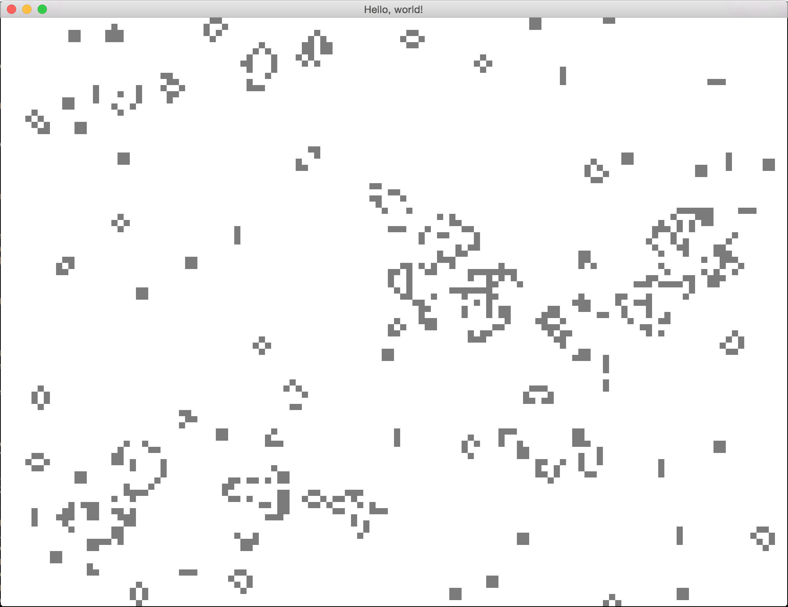
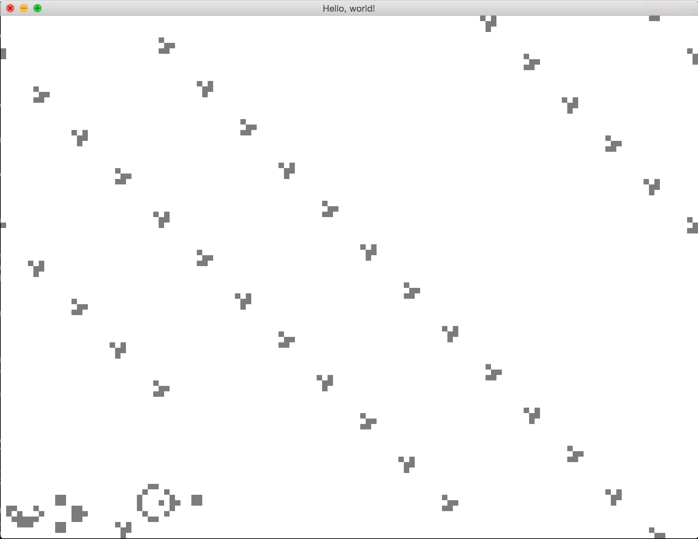

# Conway's Game of Life in Rust!

Original comment see below, I added a few features experimentally to learn more about rust

try: cargo run --release -- -q 8 -w 256 -h 192 -s 10enginecordership -t 10 -g 100

* P - pauses the generation
* Up - speeds the generation up
* Down - slows the generation down

# Original Readme

This is my first attempt at making something real in Rust, built using various Rust nightlies in the month or so
leading up to the first stable release. 

It has a 128x96 grid, wrapping on both axes, and rendered at 60fps using OpenGL, with [glium](http://github.com/tomaka/glium).

Run it with `cargo run [seed_name]`. Valid seeds are `random` and `gosper_glider`. The default is `random`.

I've tested it on OSX and Windows. It may or may not work on Linux.

From a random seed:

From the glider seed:

The code looks OK to me, but I'm still learning the basics of Rust, so I'd be keen to get any feedback (or even pull
requests!) to help me improve the code :)
